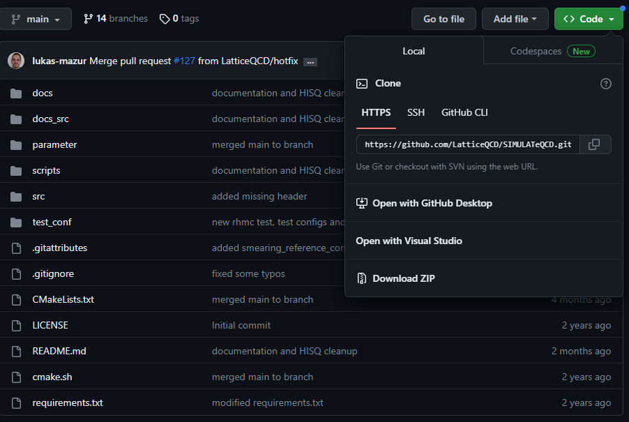

# SIMULATeQCD


[](https://latticeqcd.github.io/SIMULATeQCD)
[](https://github.com/LatticeQCD/SIMULATeQCD/commits/main)


*a SImple MUlti-GPU LATtice code for QCD calculations*


SIMULATeQCD is a multi-GPU Lattice QCD framework that makes it simple and easy for physicists to implement lattice QCD formulas while still providing the best possible performance.

- [SIMULATeQCD](#simulateqcd)
  - [How to Build](#how-to-build)
    - [Prerequisites](#prerequisites)
    - [Download SimulateQCD](#download-simulateqcd)
      - [Manual Download](#manual-download)
      - [Using git Command Line](#using-git-command-line)
    - [Compile Using Container](#compile-using-container)
      - [Install Podman](#install-podman)
      - [Build the Code](#build-the-code)
    - [Compile Manually](#compile-manually)
  - [Example: Plaquette action computation](#example-plaquette-action-computation)
  - [Documentation](#documentation)
  - [Getting help and bug report](#getting-help-and-bug-report)
  - [Contributors](#contributors)
  - [Citing SIMULATeQCD](#citing-simulateqcd)
  - [Acknowledgment](#acknowledgment)

## How to Build

### Prerequisites

You will need to install [`git-lfs`](https://git-lfs.github.com/) before continuing or you will need to use a git client which natively supports it.

### Download SimulateQCD

#### Manual Download

1. Go to [SIMULATeQCD's website](https://github.com/LatticeQCD/SIMULATeQCD)
2. Click the green *Code* button and then click *Download Zip*



3. Extract the zip in a location of your choosing and extract it

#### Using git Command Line

Run `git clone https://github.com/LatticeQCD/SIMULATeQCD.git`

### Compile Using Container

#### Install Podman

**On RHEL-based (Rocky/CentOS/RHEL) systems**

Before continuing make sure there are no updates pending with `sudo dnf update -y && sudo dnf install -y podman` and then reboot with `sudo reboot`. The reboot just makes avoiding permissions / kernel issues easy because that stuff is reread on boot.

**On Arch-based systems**

See [install instructions](https://wiki.archlinux.org/title/Podman). If you have installed Arch before the upgrade to shadow (as in /etc/shadow) 4.11.1-3 rootless podman may encounter some issues. The build script will check for these anomalies and prompt you if you need to fix them.

**Other \*NIX Systems**

If you have a non RHEL-based OS see [here](https://podman.io/getting-started/installation.html#linux-distributions) for installation instructions.

------------

Run `podman run hello-world` as your user to test your privileges. If this does not run correctly, simulateqcd will not run correctly.

**WARNING**: If you are SSH'ing to your server, make sure you ssh as a user and **not** root. If you SSH as root and then `su` to user, podman will issue `ERRO[0000] XDG_RUNTIME_DIR directory "/run/user/0" is not owned by the current user`. This happens because the user that originally setup `/run` is root rather than your user.

#### Build the Code

1. Update [config.yml](./podman-build/config.yml) with any settings you would like to use for your build. This includes your target output directory.
   1. You can run `<where_you_downloaded>/simulate_qcd.sh list` to get a list of possible build targets.
   2. If you want to change where the code outputs to, you need to update OUTPUT_DIRECTORY in [config.yml](./podman-build/config.yml). It will create a folder called build in the specified folder.
2. Run `chmod +x ./simulate_qcd.sh && ./simulate_qcd.sh build`

### Compile Manually

You will need to download the following before continuing:

* `cmake` (Some versions have the "--phtread" compiler bug. Versions that definitely work are [3.14.6](https://gitlab.kitware.com/cmake/cmake/tree/v3.14.6) or 3.19.2.)
* `C++` compiler with `C++17` support.
* `MPI` (e.g. `openmpi-4.0.4`).
* `CUDA Toolkit` version 11+. 
* `pip install -r requirements.txt` to build the documentation.

To setup the compilation, create a folder outside of the code directory (e.g. `../build/`) and **from there** call the following example script: 
```shell
cmake ../SIMULATeQCD/ \
-DARCHITECTURE="70" \
-DUSE_GPU_AWARE_MPI=ON \
-DUSE_GPU_P2P=ON \
``` 
Here, it is assumed that your source code folder is called `SIMULATeQCD`. **Do NOT compile your code in the source code folder!**
You can set the path to CUDA by setting the `cmake` parameter `-DCUDA_TOOLKIT_ROOT_DIR:PATH`.
`-DARCHITECTURE` sets the GPU architecture (i.e. [compute capability](https://en.wikipedia.org/wiki/CUDA#GPUs_supported) version without the decimal point). For example "60" for Pascal and "70" for Volta. 
Inside the build folder, you can now begin to use `make` to compile your executables, e.g. 
```shell
make NameOfExecutable
```
If you would like to speed up the compiling process, add the option `-j`, which will compile in parallel using all available CPU threads. You can also specify the number of threads manually using, for example, `-j 4`.

Popular production-ready executables are:
```Shell
# generate HISQ configurations
rhmc                 # Example Parameter-file: parameter/applications/rhmc.param
# generate quenched gauge configurations using HB and OR
GenerateQuenched     # Example Parameter-file: parameter/applications/GenerateQuenched.param
# Apply Wilson/Zeuthen flow and measure various observables
gradientFlow         # Example Parameter-file: parameter/applications/gradientFlow.param
# Gauge fixing
gaugeFixing          # Example Parameter-file: parameter/applications/gaugeFixing.param
```
In the [documentation](https://latticeqcd.github.io/SIMULATeQCD/03_applications/applications.html) you will find more information on how to execute these programs.

## Example: Plaquette action computation

(See [Full code example](https://github.com/LatticeQCD/SIMULATeQCD/blob/main/src/examples/main_plaquette.cu).)

```C++
template<class floatT, bool onDevice, size_t HaloDepth>
struct CalcPlaq {
  gaugeAccessor<floatT> gaugeAccessor;
  CalcPlaq(Gaugefield<floatT,onDevice,HaloDepth> &gauge) : gaugeAccessor(gauge.getAccessor()){}
  __device__ __host__ floatT operator()(gSite site) {
    floatT result = 0;
    for (int nu = 1; nu < 4; nu++) {
      for (int mu = 0; mu < nu; mu++) {
        result += tr_d(gaugeAccessor.template getLinkPath<All, HaloDepth>(site, mu, nu, Back(mu), Back(nu)));
      }
    }
    return result;
  }
};

(... main ...)
latticeContainer.template iterateOverBulk<All, HaloDepth>(CalcPlaq<floatT, HaloDepth>(gauge))
```


## Documentation

Please check out [the documentation](https://latticeqcd.github.io/SIMULATeQCD) to learn how to use SIMULATeQCD.

## Getting help and bug report
Open an [issue](https://github.com/LatticeQCD/SIMULATeQCD/issues), if...
- you have troubles compiling/running the code.
- you have questions on how to implement your own routine.
- you have found a bug.
- you have a feature request.

If none of the above cases apply, you may also send an email to lukas.mazur(at)uni-paderborn(dot)de.


## Contributors

[L. Mazur](https://github.com/lukas-mazur), 
[S. Ali](https://github.com/Sajidali1031), 
[L. Altenkort](https://github.com/luhuhis), 
[D. Bollweg](https://github.com/dbollweg), 
[D. A. Clarke](https://github.com/clarkedavida), 
[H. Dick](https://github.com/redweasel),
[J. Goswami](https://github.com/jishnuxx)
[O. Kaczmarek](https://github.com/olaf-kaczmarek), 
[R. Larsen](https://github.com/RasmusNL), 
M. Neumann,
M. Rodekamp, 
[H. Sandmeyer](https://github.com/hsandmeyer), 
[C. Schmidt](https://github.com/schmidt74), 
[P. Scior](https://github.com/philomat), 
[H.-T. Shu](https://github.com/haitaoshu), 
[G. Curell](https://github.com/grantcurell/)

## Citing SIMULATeQCD

If you are using this code in your research please cite:

- *L. Mazur, Topological aspects in lattice QCD, Ph.D. thesis, Bielefeld University (2021), [https://doi.org/10.4119/unibi/2956493](https://doi.org/10.4119/unibi/2956493)*
- *L. Altenkort, D.Bollweg, D. A. Clarke, O. Kaczmarek, L. Mazur, C. Schmidt, P. Scior, H.-T. Shu, HotQCD on Multi-GPU Systems, PoS LATTICE2021, Bielefeld University (2021), [https://arxiv.org/abs/2111.10354](https://arxiv.org/abs/2111.10354)*

## Acknowledgment

- We acknowledge support by the Deutsche Forschungsgemeinschaft (DFG, German Research Foundation) through the CRC-TR 211 
'Strong-interaction matter under extreme conditions'– project number 315477589 – TRR 211.
- This work was partly performed in the framework of the PUNCH4NFDI consortium supported by DFG fund "NFDI 39/1", Germany.
- This work is also supported by the U.S. Department of Energy, Office of Science, though the Scientific Discovery through Advance 
Computing (SciDAC) award Computing the Properties of Matter with Leadership Computing Resources.
- We would also like to acknowedge enlightening technical discussions with the ILDG team, in particular H. Simma. 
